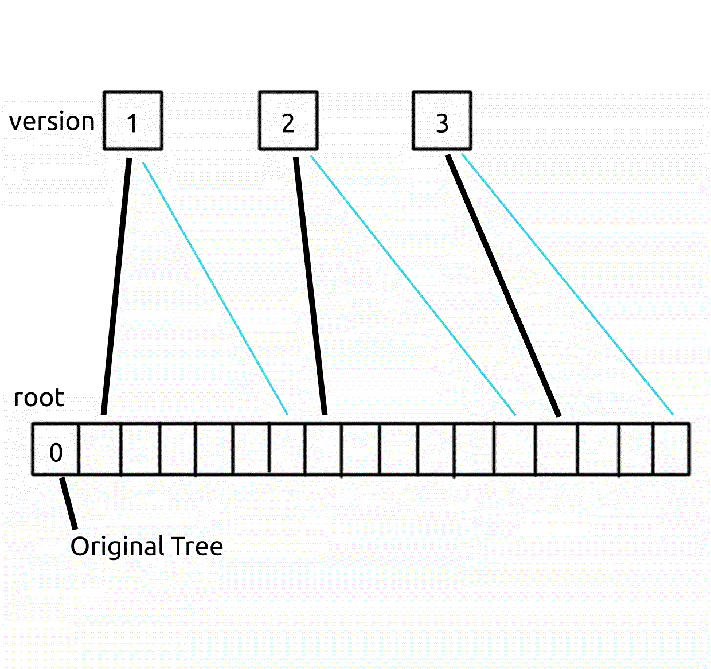

## 板子

### 数据结构

#### 并查集

```cpp
struct DSU
{
    int *fa;
    int N;
    
    DSU(int n)
    {
        N = n + 10;
        fa = (int*)malloc(N*sizeof(int));
        for(int i=1;i<=n;++i)
        	fa[i] = i;
    }
    virtual ~DSU()
    {
        free(fa);fa=NULL;
    }
    int get(int x)
    {
        if(fa[x]==x)
        	return x;
       	return fa[x] = get(fa[x]);
    }
    inline void merge(int x, int y)
    {
        int rtx = get(x);
        int rty = get(y);
        if(rtx==rty)
        	return ;
        fa[rtx] = rty;
        return ;
    }
};
```

###### 复杂度

`DSU(int n);`  -> $O(N)$

`get(int x);`  -> $O(\log N)$

`merge(int x, int y);`  -> $O(\log N)$


#### 可持久化并查集

*基于可持久化数组*

```cpp
struct PersistentArray
{
    struct Node
    {
        int val;
        int lson, rson;
    };
    static Node pool[SIZE];
    static int pool_cnt;
    int newNode()
    {
        ++pool_cnt;pool[pool_cnt] = {0, 0, 0};
        return pool_cnt;
    }
    std::vector<int> root;
    int dL, dR;
    
    PersistentArray(int l, int r)
    {
        root.push_back(newNode());
        dL = l;dR = r;
        build(root[0], dL, dR);
    }
    void build(int rt, int l, int r)
    {
        if(l==r){pool[rt].val = l;return;}
        int mid = ((l+r)>>1);
        pool[rt].lson = newNode();build(pool[rt].lson, l, mid);
        pool[rt].rson = newNode();build(pool[rt].rson, mid+1, r);
    }
    int change(int rt, int p, int val)
    {
        int newrt = newNode();
        find_c(rt, newrt, dL, dR, p) = val;
        return newrt;
    }
    int& find_c(int rt, int newrt, int l, int r, const int p)
    {
        if(l==r){pool[newrt] = pool[rt];return pool[newrt].val;}
        int mid = ((l+r)>>1);
        pool[newrt] = pool[rt];
        if(p<=mid){pool[newrt].lson=newNode();return find_c(pool[rt].lson, pool[newrt].lson, l, mid, p);}
        else {pool[newrt].rson=newNode();return find_c(pool[rt].rson, pool[newrt].rson, mid+1, r, p);}
    }
    int find_q(int rt, int l, int r, int p)
    {
        if(l==r){return pool[rt].val;}
        int mid = ((l+r)>>1);
        if(p<=mid){return find_q(pool[rt].lson, l, mid, p);}
        else {return find_q(pool[rt].rson, mid+1, r, p);}
    }
    void print_s(int rt, int l, int r)
    {
        if(l==r){printf("%d ", pool[rt].val);return ;}
        int mid = ((l+r)>>1);
        print_s(pool[rt].lson, l, mid);
        print_s(pool[rt].rson, mid+1, r);
    }
    void print()
    {
        print_s(root[root.size()-1], dL, dR);
        printf("\n");
    }
};
PersistentArray::Node PersistentArray::pool[SIZE];
int PersistentArray::pool_cnt = -1;

int get(int x, PersistentArray& fa, int& root)
{
    int faa = fa.find_q(root, fa.dL, fa.dR, x);
    if(faa==x)
        return x;
    int anc = get(faa, fa, root);
    fa.pool[root] = fa.pool[fa.change(root, x, anc)]; /*tag1*/
    return anc;
}
```

在主函数中:

```cpp
int tmp = arr.root[id-1];
a = get(a, arr, tmp);
b = get(b, arr, tmp);
arr.root.push_back(tmp);
```

**WARNING: 上述片段的第74行(倒数第3行)，即末尾有tag1的一行 这一行很值得品位**

**此行在可持久化数组上修改了一个节点(即创建了一个新根)，并将旧根赋值为新根，这样保证一个版本的全部修改都在一个根上可以访问到**



**如上图为含有三个版本的并查集(由于路径压缩，查询也需要记入一个版本)**

**黑色线是各版本对应的根，而蓝色线为本版本实际应访问的入口**

**上述的赋值操作保证了从黑色线也能进入蓝线所指向的位置**

**实现上，黑线指向的位置在主函数中体现为 `tmp` 变量**


#### 树状数组

```cpp
template<typename T>
struct BIT
{
    T *c;
    int N;
    
    BIT(int n)
    {
        N = n + 10;
        c = (T*)calloc(N, sizeof(T));
    }
    ~BIT()
    {
        free(c);c=NULL;
    }
    void add(int x, T y)
    {
        for(;x<N;x+=(x&(-x)))c[x] += y;
    }
    T ask(int x)
    {
        T ans = 0;
        for(;x;x-=(x&(-x)))ans += c[x];
        return ans;
    }
};
```

**将add()和ask()内的for互换可改为求后缀**

###### 复杂度

`add(int x, T y);`  -> $O(\log N)$

`ask(int x);`  -> $O(\log N)$


#### Splay

```cpp
#include <cstdio>
#include <cstdlib>
#include <cstring>
#include <climits>
#include <queue>
typedef long long int64;
typedef long long unsigned uint64;
typedef int unsigned uint32;

constexpr uint32 SPLAY_POOL_SIZE = 200010;
struct Splay
{
    typedef int key_t;
    typedef uint32 rank_t;
    typedef uint32 size_t;
    struct Node
    {
        key_t key;
        size_t cnt, size;

        Node *fa, *son[2];
        void clear(){key=0;cnt=size=0;fa=son[0]=son[1]=nullptr;}
    };
    static Node pool[SPLAY_POOL_SIZE];
    static int pool_cnt;
    static std::queue<Node*> pool_q;
    Node *newNode()
    {
        if(pool_q.size()){Node *ans = pool_q.front();pool_q.pop();return ans;}
        return pool + (++pool_cnt);
    }
    void deleteNode(Node *p)
    {
        p->clear();
        pool_q.push(p);
    }

    Node *root;
    Splay():root(nullptr){}
    void update(Node *p)
    {
        if(p==nullptr)return;
        p->size = p->cnt;
        if(p->son[0]!=nullptr)p->size += p->son[0]->size;
        if(p->son[1]!=nullptr)p->size += p->son[1]->size;
    }
    bool get(Node *p)
    {
        return p->fa->son[1] == p;
    }
    void rotate(Node *p)
    {
        if(p==nullptr)return;
        if(p->fa==nullptr)return;

        Node *fa, *ffa, *s;
        bool which = get(p);
        fa = p->fa;
        ffa = p->fa->fa;
        s = p->son[!which];

        if(ffa!=nullptr)ffa->son[get(fa)] = p;
        fa->son[which] = s;
        p->son[!which] = fa;
        if(s!=nullptr)s->fa = fa;
        p->fa = ffa;
        fa->fa = p;

        update(fa);
        update(p);
    }
    void splay(Node *p, Node *tar = nullptr)
    {
        for(;p->fa!=tar;)
        {
            if(p->fa->fa!=tar) rotate((get(p->fa)==get(p))? p->fa : p );
            rotate(p);
        }
        if(tar==nullptr)root = p;
    }
    bool extract(key_t key)
    {
        Node *p = root;
        for(;;)
        {
            if(p==nullptr)return false;
            if(p->key==key)
            {
                splay(p);
                return true;
            }
            p = p->son[key > p->key];
        }
    }
    Node* prev()
    {
        if(root->son[0]==nullptr)return nullptr;
        Node *p = root->son[0];
        for(;p->son[1]!=nullptr;)p = p->son[1];
        return p;
    }
    Node* next()
    {
        if(root->son[1]==nullptr)return nullptr;
        Node *p = root->son[1];
        for(;p->son[0]!=nullptr;)p = p->son[0];
        return p;
    }

    void insert(key_t key)
    {
        Node *p = root, *fa = nullptr;
        for(;;)
        {
            if(p==nullptr)
            {
                p = newNode();
                if(fa!=nullptr) fa->son[key > fa->key] = p;
                p->fa = fa;
                p->key = key;
                p->cnt = 1;
                update(p);update(fa);
                splay(p);
                return;
            }
            if(p->key==key)
            {
                ++p->cnt;
                update(p);update(fa);
                splay(p);
                return;
            }
            fa = p;p = p->son[key > p->key];
        }
    }
    void erase(key_t key)
    {
        extract(key);
        if(root->cnt > 1)
        {
            --root->cnt;
            update(root);
            return;
        }
        if(root->son[0]==nullptr&&root->son[1]==nullptr)
        {
            deleteNode(root);root=nullptr;
            return;
        }
        if(root->son[0]==nullptr)
        {
            Node *old_root = root;
            root = root->son[1];
            root->fa = nullptr;
            deleteNode(old_root);old_root=nullptr;
            return;
        }
        if(root->son[1]==nullptr)
        {
            Node *old_root = root;
            root = root->son[0];
            root->fa = nullptr;
            deleteNode(old_root);old_root=nullptr;
            return;
        }
        Node *old_root = root;
        splay(prev());
        root->son[1] = old_root->son[1];
        old_root->son[1]->fa = root;
        deleteNode(old_root);old_root=nullptr;
        return;
    }
    key_t find_by_rank(rank_t rank)
    {
        Node *p = root;
        for(;;)
        {
            if(p==nullptr)return INT_MAX;
            size_t size0 = (p->son[0]==nullptr)? 0 : p->son[0]->size ;
            if(size0<=rank&&rank<size0+p->cnt)
            {

                return p->key;
            }
            if(rank<size0)
            {
                p = p->son[0];
            }
            else
            {
                rank -= size0 + p->cnt;
                p = p->son[1];
            }
        }
    }
    rank_t query_rank(key_t key)
    {
        insert(key);
        extract(key);
        rank_t rank = (root->son[0]==nullptr)? 0 : root->son[0]->size ;
        erase(key);
        return rank;
    }
    key_t prev(key_t key)
    {
        insert(key);
        extract(key);
        Node *p = prev();
        key_t ans = (p==nullptr)? INT_MIN : p->key ;
        erase(key);
        return ans;
    }
    key_t next(key_t key)
    {
        insert(key);
        extract(key);
        Node *p = next();
        key_t ans = (p==nullptr)? INT_MIN : p->key ;
        erase(key);
        return ans;
    }
};
Splay::Node Splay::pool[SPLAY_POOL_SIZE];
int Splay::pool_cnt;
std::queue<Splay::Node*> Splay::pool_q;
```

>   record:
>
>   2023-10-13 07:15 a.m. 36min


### 图论

#### 邻接表

```cpp
struct Graph
{
    struct Edge{int next, to, val;};
	std::vector<Edge> edg;
    int *h, N;
    
    Graph(int n)
    {
        N = n + 10;
        h = (int*)calloc(N, sizeof(int));
        edg.clear();
        edg.push_back({0,0,0});
        edg.push_back({0,0,0});//此处是为了使下标从2开始
    }
    ~Graph(){free(h);h=NULL;}
    void addedg(int x, int y, int z)
    {
        edg.push_back({.next=h[x], .to=y, .val=z});
        h[x] = edg.size() - 1;
    }
};
```

**构造函数中一定要插入至少一次（两次是为了无向边的奇偶变换），否则会使第一条边编号为 $0$ 从而无法访问**

###### 复杂度

`addedg(int x, int y, int z)`  -> $O(1)$


#### LCA(Tarjan)

```cpp
struct LCA_Tarjan
{
    Graph *g;
    Graph *query;
    int *ans, *fa, *mk;
    
    LCA_Tarjan(Graph *g_ptr, int n)
    {
        g = g_ptr;
        query = new Graph(n);
        ans = NULL;
        fa = (int*)malloc((n+10)*sizeof(int));
        for(int i=1;i<=n;++i)
            fa[i] = i;
        mk = (int*)calloc(n+10, sizeof(int));
    }
    ~LCA_Tarjan()
    {
        delete query;query=NULL;
        free(ans);ans=NULL;
        free(fa);fa=NULL;
        free(mk);mk=NULL;
    }
    void add(int id, int x, int y)
    {
        query->add(x, y, id);
        query->add(y, x, id);
    }
    int get(int x)
    {
        if(fa[x]==x){return x;}
        return fa[x] = get(fa[x]);
    }
    void dfs(int rt, int fath)
    {
        mk[rt] = 1;
        for(int i=g->h[rt],y;i;i=g->edg[i].next)
        {
            y = g->edg[i].to;
            if(y==fath)continue;
            dfs(y, rt);
        }
        for(int i=query->h[rt],y;i;i=query->edg[i].next)
        {
            y = query->edg[i].to;
            if(mk[y]==2||rt==y)
            {
                int rty = get(y);
                ans[query->edg[i].val] = rty;
            }
        }

        mk[rt] = 2;
        fa[rt] = fath;
    }
    void cal(int rt)
    {
        ans = (int*)malloc((query->edg.size()/2)*sizeof(int));
        dfs(rt, 0);
    }
};
```

**in main()**

```cpp
LCA_Tarjan lca(&g, n);
for(int i=1;i<=m;++i)lca.add(i, x, y);
lca.cal(root);
for(int i=1;i<=m;++i)printf("%d\n", lca.ans[i]);
```

###### 复杂度

离线处理所有询问总复杂度 $O(n+m)$ 其中 $n$ 为节点个数，$m$ 为询问个数


### 数学

#### 同余

```cpp
typedef long long int64;
struct Int
{
    static int64 MOD;
    int64 val;
    Int(){val=0ll;}
    Int(int x){val=(x%MOD+MOD)%MOD;}
    Int(int64 x){val=(x%MOD+MOD)%MOD;}
    Int operator + (Int b){return Int((val+b.val)%MOD);}
    Int operator - (Int b){return Int(((val-b.val)%MOD+MOD)%MOD);}
    Int operator * (Int b){return Int((val*b.val)%MOD);}
    void operator += (Int b){val=(val+b.val)%MOD;}
    void operator -= (Int b){val=((val-b.val)%MOD+MOD)%MOD;}
    void operator *= (Int b){val=(val*b.val)%MOD;}
};
int64 Int::MOD = 998244353;
```

**注:** 

-   适用几乎所有需要取模的题目（注意可能常数有一丢丢大）

-   `998244353` 可替换成任意需要用的模数
-   未写出除法运算，但实际上可以通过求逆元得到除法运算的定义


### 杂项

#### 离散化

```cpp
template<typename T>
struct Discrete
{
    std::vector<T> data;

    inline void add(T x){data.push_back(x);}
    inline void discrete()
    {
        std::sort(data.begin(), data.end());
        data.resize(std::unique(data.begin(), data.end()) - data.begin());
    }
    inline int id(T x){return std::lower_bound(data.begin(), data.end(), x) - data.begin() + 1;}
    inline T val(int id){return data[id - 1];}
};
```

###### 复杂度

`add(T x);`  -> $O(1)$

`discrete()`  -> $O(N\log N)$

`id(T x)`  -> $O(\log N)$

`val(int id)`  -> $O(1)$

**此模板离散化后的值下标从 $1$ 开始**


#### 最值

```cpp
template<typename T> inline T wlmin(T a, T b){return (a<b)?a:b;}
template<typename T> inline T wlmax(T a, T b){return (a<b)?b:a;}
```

###### 复杂度

均为 $O(1)$


[^1]: 可能存在缺陷，需要更新
